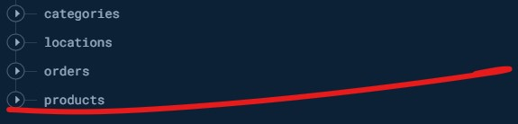

# Platilla de E-Commerce

#### Es un proyecto de app en React/Expo, tiene como objetivo de ser el prototipo base de futuros proyectos futuros de e-commerce y personalizados.

## Instalaciones base del proyecto

En cualquiera de los casos el proyecto se puede descargar directamente del repositorio con: 

```
gh repo clone DinoIgnaAndrade/Plantilla-E-Commerce
```
Y para iniciar el proyecto.
```
npx expo start
```

##### 
[Node Js](https://nodejs.org/en)
En su versión 20.11.0.
Puede Instalar el Node de manera sencilla sin modificar nada en especifico.


[Expo](https://expo.dev/)
En su version 50.0.6.
Expo tiene tanto las herramientas como las bases para inicializar un nuevo proyecto para android y ios.
```
npx create-expo-app --template
```


[React / React Native](https://expo.dev/)
React version ^18.2.0 
React Native  ^0.73.4
Se instala con Expo.
#####En cualquier caso actualzar a versiones que pida el projecto. 
## Dependencias Utilizadas

### Navegación:

#### [React Navigation](https://reactnavigation.org/)

- **@react-navigation/native:6.1.9** Proporciona la implementación principal de la navegación en React Native.
```
npm install @react-navigation/native
```

- **@react-navigation/native-stack:6.9.17** Se encarga de la navegación tipo pila en la aplicación.
```
npm install @react-navigation/native-stack
```
- **@react-navigation/bottom-tabs:6.5.11** Utilizado para implementar pestañas de navegación en la parte inferior de la pantalla.
```
npm install @react-navigation/bottom-tabs
```

### Estado Global:

#### [Redux](https://redux.js.org/)

- **react-redux:9.1.0** Proporciona integración de Redux con React, permitiendo el uso del estado global de Redux en componentes React.

```
# NPM
npm install redux

# Yarn
yarn add redux
```

- **@reduxjs/toolkit:2.1.0** Facilita el uso de Redux, que es un contenedor de estado predecible para aplicaciones JavaScript.
```
# NPM
npm install @reduxjs/toolkit

# Yarn
yarn add @reduxjs/toolkit
```

### Persistencia de Datos:
#### [Expo SQLite](https://docs.expo.dev/versions/latest/sdk/sqlite/)
En su version ~13.2.2, utilizado para persistir datos de inicio de sesion y perfil del usuario.
```
npx expo install expo-sqlite
```

### Servicios de Ubicacion:
#### [Expo Location](https://docs.expo.dev/versions/latest/sdk/location/)
En su version ^16.5.3, este se utiliza como parte del proceso para ayudar a los servicios de google a generar un mapa con la ubicacion en latitud y longitudd.
```
npx expo install expo-location
```

### Servicio de validacion de credenciales:
#### [yup](https://www.npmjs.com/package/yup)
En su version ^1.3.3, utilizado para validar datos de formularios en aplicaciones web y móviles. La biblioteca permite definir esquemas de validación de forma sencilla y expresiva. En este proyecto, para validar las entreadas en Login y SignUp.
```
npm install -S yup
```

### Personalización:

- **[react-native-swiper:1.6.0-rc.3](https://www.npmjs.com/package/react-native-swiper)** Proporciona un componente de deslizamiento útil para crear presentaciones de diapositivas o carruseles.

- **[@expo/vector-icons](https://icons.expo.fyi/Index)** Proporciona los iconos utilizados en la aplicacion.

### Archivo Indispesables: 
Dentro del repo, se encuentra una carpeta con 2 archivos. El '.env' se copia y pega en la carpeta principal del proyecto, lo que seria la capeta 'platillaEcommerce'. El '.env' tiene las indicaciones de las credenciales que necesita de parte de FireBase y de googleMaps. 
El archivo json se usa para la creacion de la base de datos, para la seccion de productos(products). Lo ideal es que la base de datos se vea de esta forma:



Y las categorias deberia contener estos:

```
[
    "smartphones",
    "laptops",
    "fragrances",
    "skincare",
    "groceries",
    "home-decoration",
    "furniture",
    "tops",
    "womens-dresses",
    "womens-shoes",
    "mens-shirts",
    "mens-shoes",
    "mens-watches",
    "womens-watches",
    "womens-bags",
    "womens-jewellery",
    "sunglasses",
    "automotive",
    "motorcycle",
    "lighting"
]
```
Las 2 carpetas restantes se crean con la aplicacion.

### Configuracion de FireBase y GoogleMaps en cloud:
En firebase si bien se utiliza Realtime DataBase, que es en donde se configuran los datos anteriormente posteados, tambien es necesario la activacion del servicio Authentication, y que se active la opción de correo electronico como validación. 

Hablando de Google Maps, al crear el proyecto y activar las opciones de Google Maps, es necesario tener los siguiente servicios activados.

- **Maps Elevation API**
- **Maps Embed API** 
- **Maps JavaScript API** 
- **Maps SDK for Android** 
- **Maps SDK for iOS**  
- **Maps Static API** 
- **Geocoding API** 
- **Geolocation API** 
- **Places API** 

### Mejoras y Consideraciones finales:
El proyecto se Inicio hace 20 dias, no desde 0 pero casi, volviendo a trabajar el apartado de navegacion con su version anterior de [E-Commerce](https://github.com/DinoIgnaAndrade/E-Commerce.git), mejorando varios apartados visuales, navegacion y logica por parte de los procesos, descartando y agregando funciones, y metodos. La aplicacion a el dia de la fecha martes (13/2/2024) no esta terminada del todo, pero se espera que tenga todos lo requisitos necesarios.

- **Favoritos:(Pendiente)** Falto la implentacion de una pantalla con productos favoritos. La idea es hacer un post para la firebase para que guarde el id de productos relacionado con mail de usuario en la base de datos y que la app haga la peticion correspondiente.

- **Arreglo de la build del apk:(Pendiente)** Uno de los problemas presentes, es que si bien Expo contruye el archivo, por alguna razon no realiza las peticiones a la base de datos y no ingresa ningun tipo de dato.

- **Mejora de apartado Visual de Orders:(Pendiente)** Con el tiempo limite le falto un poco de personalizacion y correccion. En los siguinetes dias despues de la evaluacion se mejorara.

- **Agregado de apartado para tarjetas de credito:(Pendiente)** Toda app de e-commerce tendria uno. Pero en general solo sera el estado visual, la logica para guardar datos todavia no. 

- **Agregado de un Input de Busqueda:(Pendiente)** Se omitio el simple input de busqueda. 
- **Cambio de iconos:(Pendiente)** Se crearan iconos personalizado. 
- **Mejora del apartado de Ubicacion:(Pediente)** Se ve feo y no me gusta, ademas el objetivo es hacerlo mas interactivo con la posibilidad de poner ubicacion personalizada.

- #### Agregado de Animaciones con **[React Native Reanimated](https://www.reanimated2.com/)(Pediente)**
En el momento que se terminen los arreglos anteriores y el desarrollo llegue a un punto base estable se incurcionara en desarrollo de sus animaciones al mas puro estilo ezquiso sin vida que no va a ver la luz del sol el los siguientes 9 meses. 
El objetivo en lograr animaciones satisfactorias y fluidas. 


Fin.